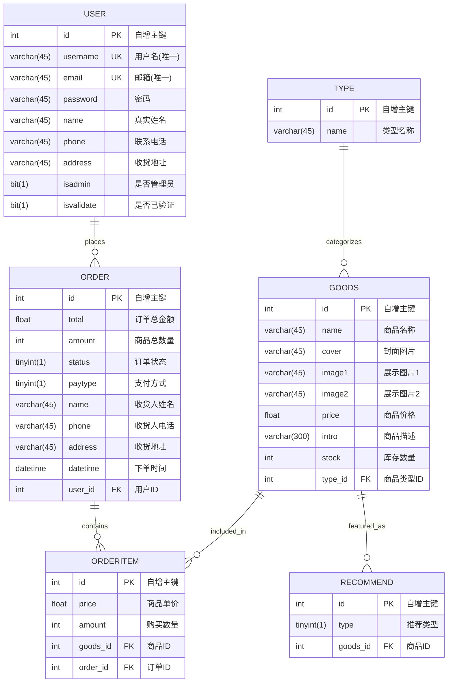

# CookieShop 数据库 ER 图

## 数据库概览
- **数据库名称**: cookieshop
- **字符集**: utf8mb4
- **存储引擎**: InnoDB
- **外键约束**: 已启用

---

## ER 图 (Entity-Relationship Diagram)



---

## 实体说明

### 1. USER (用户表)
**业务含义**: 存储系统用户信息,包括普通用户和管理员

**核心字段**:
- `id`: 主键,自增
- `username`: 用户名,唯一索引
- `email`: 邮箱,唯一索引
- `isadmin`: 管理员标识 (0=普通用户, 1=管理员)
- `isvalidate`: 账号验证状态

**关系**:
- 一个用户可以创建多个订单 (1:N)

---

### 2. ORDER (订单表)
**业务含义**: 存储用户下单信息及收货信息

**核心字段**:
- `id`: 主键,自增
- `total`: 订单总金额
- `amount`: 商品总数量
- `status`: 订单状态 (1=待支付, 2=已支付, 3=配送中, 4=已完成)
- `paytype`: 支付方式 (1=在线支付, 2=货到付款)
- `datetime`: 下单时间
- `user_id`: 外键,关联用户表

**关系**:
- 属于一个用户 (N:1)
- 包含多个订单项 (1:N)

---

### 3. ORDERITEM (订单项表)
**业务含义**: 订单明细,记录订单中每个商品的购买信息

**核心字段**:
- `id`: 主键,自增
- `price`: 购买时的商品单价
- `amount`: 购买数量
- `goods_id`: 外键,关联商品表
- `order_id`: 外键,关联订单表

**关系**:
- 属于一个订单 (N:1)
- 关联一个商品 (N:1)

---

### 4. GOODS (商品表)
**业务含义**: 存储商城商品信息

**核心字段**:
- `id`: 主键,自增
- `name`: 商品名称
- `cover`: 商品封面图
- `image1/image2`: 商品展示图
- `price`: 商品价格
- `intro`: 商品详细描述
- `stock`: 库存数量
- `type_id`: 外键,关联商品类型表

**关系**:
- 属于一个商品类型 (N:1)
- 可以被添加到多个订单项 (1:N)
- 可以被推荐多次 (1:N)

---

### 5. RECOMMEND (推荐表)
**业务含义**: 商品推荐位配置,用于首页展示

**核心字段**:
- `id`: 主键,自增
- `type`: 推荐类型 (1=热门推荐, 2=新品推荐, 3=特价推荐)
- `goods_id`: 外键,关联商品表,级联删除

**关系**:
- 关联一个商品 (N:1)
- 当商品被删除时,推荐记录自动删除 (ON DELETE CASCADE)

---

### 6. TYPE (商品类型表)
**业务含义**: 商品分类管理

**核心字段**:
- `id`: 主键,自增
- `name`: 类型名称

**现有分类**:
- 冰淇淋系列 (id=1)
- 零食系列 (id=2)
- 儿童系列 (id=3)
- 法式系列 (id=4)
- 经典系列 (id=5)
- 节日系列 (id=8)
- 买不起系列 (id=11)

**关系**:
- 一个类型可以包含多个商品 (1:N)

---

## 关系详解

### 外键约束

| 从表 | 外键字段 | 主表 | 主表字段 | 约束名称 | 级联规则 |
|------|----------|------|----------|----------|----------|
| goods | type_id | type | id | fk_type_id | RESTRICT |
| order | user_id | user | id | fk_user_id | RESTRICT |
| orderitem | order_id | order | id | fk_order_id | RESTRICT |
| orderitem | goods_id | goods | id | fk_orderitem_goods_id | RESTRICT |
| recommend | goods_id | goods | id | fk_goods_id | **CASCADE** |

**注意**: 
- recommend表的goods_id设置了`ON DELETE CASCADE`,当商品被删除时,所有相关推荐记录会自动删除
- 其他外键采用默认的RESTRICT策略,防止误删除

---

## 业务流程示例

### 用户下单流程
```
1. USER (用户登录) 
   ↓
2. GOODS (浏览商品,按TYPE分类查看)
   ↓
3. ORDER (创建订单,填写收货信息)
   ↓
4. ORDERITEM (添加订单明细,记录商品和数量)
   ↓
5. ORDER.status更新 (订单状态流转: 待支付→已支付→配送中→已完成)
```

### 商品推荐流程
```
1. 管理员在GOODS表中添加/编辑商品
   ↓
2. 在RECOMMEND表中配置推荐类型
   ↓
3. 前台首页根据type字段展示不同推荐位
   - type=1: 热门推荐
   - type=2: 新品推荐
   - type=3: 特价推荐
```

---

## 索引优化建议

### 现有索引
- `goods.type_id`: 外键索引,优化按类型查询商品
- `order.user_id`: 外键索引,优化查询用户订单列表
- `orderitem.order_id`: 外键索引,优化查询订单详情
- `orderitem.goods_id`: 外键索引,优化商品销量统计
- `recommend.goods_id`: 外键索引,优化推荐查询
- `user.username`: 唯一索引,优化登录查询
- `user.email`: 唯一索引,优化邮箱查找

### 建议新增索引
```sql
-- 优化订单时间范围查询
CREATE INDEX idx_order_datetime ON `order`(datetime);

-- 优化商品价格排序查询
CREATE INDEX idx_goods_price ON goods(price);

-- 优化商品库存查询
CREATE INDEX idx_goods_stock ON goods(stock);

-- 优化订单状态查询
CREATE INDEX idx_order_status ON `order`(status);

-- 优化推荐类型查询
CREATE INDEX idx_recommend_type ON recommend(type);
```

---

## 数据完整性规则

### 主键约束
- 所有表都使用`id`作为自增主键,保证唯一性

### 唯一约束
- `user.username`: 用户名唯一
- `user.email`: 邮箱唯一

### 外键约束
- 保证数据一致性,防止孤立记录
- recommend表支持级联删除,避免推荐位引用不存在的商品

### 非空约束
- 主键字段自动非空
- 其他字段允许NULL,提供灵活性

---

## 性能优化考虑

### 查询优化
1. **商品列表**: 按type_id分类查询,已有索引支持
2. **用户订单**: 按user_id查询,已有索引支持
3. **订单详情**: 通过order_id关联orderitem和goods,利用外键索引
4. **首页推荐**: 通过recommend.type筛选并关联goods表

### 数据量估算
- **goods**: 约180条 (实际生产可达数千至上万)
- **user**: 约2条 (实际生产可达数万至数十万)
- **order**: 约1条 (实际生产可达数十万至百万级)
- **orderitem**: 约1条 (订单量的2-5倍)
- **type**: 约7条 (相对稳定)
- **recommend**: 约19条 (根据推荐位数量,一般不超过100)

### 分区建议 (大数据量时)
```sql
-- 订单表按年份分区 (订单量超过100万时考虑)
ALTER TABLE `order` 
PARTITION BY RANGE (YEAR(datetime)) (
    PARTITION p2019 VALUES LESS THAN (2020),
    PARTITION p2020 VALUES LESS THAN (2021),
    PARTITION p2021 VALUES LESS THAN (2022),
    PARTITION p_future VALUES LESS THAN MAXVALUE
);
```

---

## 数据字典补充

### ORDER.status (订单状态)
| 值 | 含义 | 说明 |
|----|------|------|
| 1 | 待支付 | 订单已创建,等待用户支付 |
| 2 | 已支付 | 用户已完成支付,等待发货 |
| 3 | 配送中 | 商品已发货,正在配送 |
| 4 | 已完成 | 订单已签收完成 |
| 5 | 已取消 | 用户或系统取消订单 |

### ORDER.paytype (支付方式)
| 值 | 含义 |
|----|------|
| 1 | 在线支付 |
| 2 | 货到付款 |

### RECOMMEND.type (推荐类型)
| 值 | 含义 | 展示位置 |
|----|------|----------|
| 1 | 热门推荐 | 首页热门商品区 |
| 2 | 新品推荐 | 首页新品区 |
| 3 | 特价推荐 | 首页特价区 |

---

## 设计模式说明

### 设计原则
1. **规范化**: 符合第三范式(3NF),减少数据冗余
2. **外键完整性**: 使用外键约束保证引用完整性
3. **索引优化**: 在外键和查询频繁的字段上建立索引
4. **扩展性**: 预留字段长度,支持业务扩展

### 典型的电商三层结构
```
用户层 (USER)
    ↓
订单层 (ORDER + ORDERITEM)
    ↓
商品层 (GOODS + TYPE + RECOMMEND)
```

---

**生成时间**: 2025-10-30  
**数据库版本**: MySQL 8.0.31  
**文档版本**: v1.0
