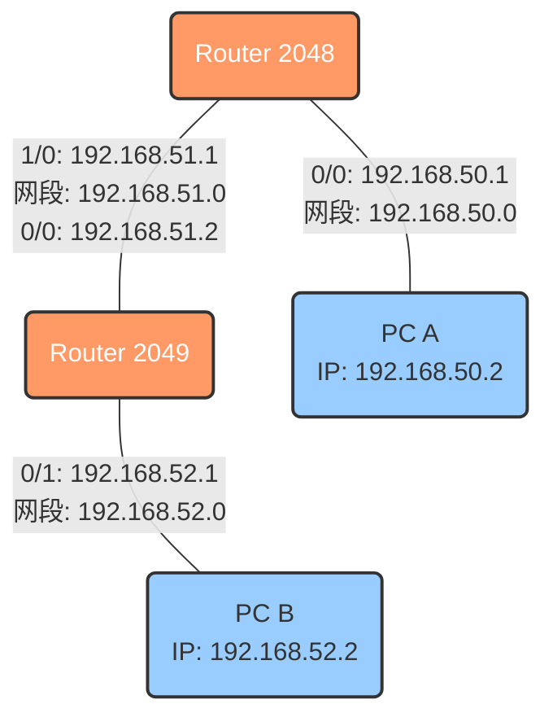
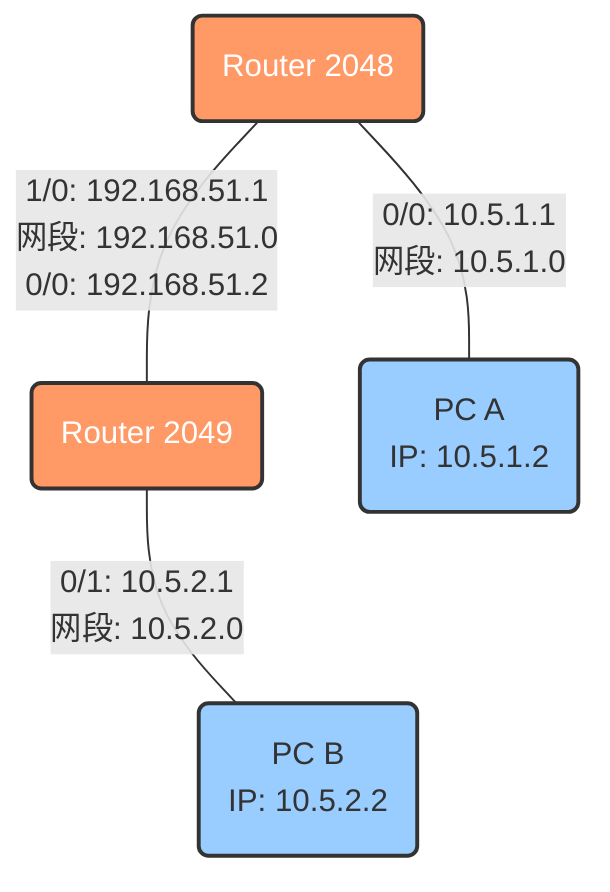
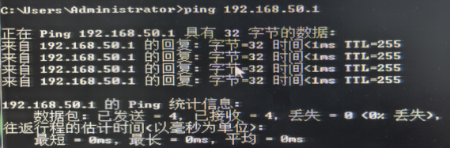
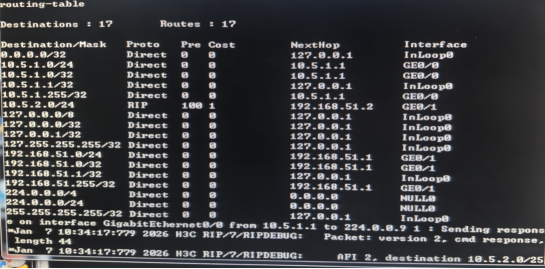

# 实验五 实验报告 — 配置 RIP

## 一、实验目的
- 加深对 RIP 协议原理的理解，掌握 RIPv1 与 RIPv2 的配置与区别。
- 熟悉 RIP 的运行机制与维护命令（`display rip`等）。

## 二、实验拓扑与 IP 配置



图1 rip v1 实验拓扑图



图2 rip v2 实验拓扑图

## 三、实验步骤与记录

### 任务一：配置 RIPv1
1. **配置接口 IP**：
   在 Router 2048 和 Router 2049 上配置接口 IP 地址，并配置 PC A (`192.168.50.2`) 和 PC B (`192.168.52.2`)。
   - 验证：在 PC A 上 `ping 192.168.50.1`（网关），确认直连连通性。
   

2. **在路由器上启用 RIPv1**：
   - **Router 2048 配置**：
     ```
     [R2048] rip 1
     [R2048-rip-1] network 192.168.50.0  (宣告左侧直连网段)
     [R2048-rip-1] network 192.168.51.0  (宣告中间互联网段)
     ```
   - **Router 2049 配置**：
     ```
     [R2049] rip 1
     [R2049-rip-1] network 192.168.52.0  (宣告右侧直连网段)
     [R2049-rip-1] network 192.168.51.0  (宣告中间互联网段)
     ```

3. **查看路由表**：
   等待 RIP 更新后，查看 `display ip routing-table`。
   - 现象记录：此时应能看到通过 RIP 学到的路由（Proto 为 RIP），目标网段分别为对方的 `192.168.52.0/24` 和 `192.168.50.0/24`。


1. **连通性测试**：
   在 PC A 上 `ping 192.168.52.2` (PC B)。
   - 结果预测：**成功**。
   - 原因：虽然是 RIPv1，但全网均为 C 类地址且连续，不存在子网汇总冲突问题。


1. **查看 RIP 运行状态**
   在路由器上执行 `display rip 1`，记录 RIP 版本（默认为 version 1）、更新间隔（Update time）、以及 Summary 状态。
   

### 任务二：RIPv2 的配置

1. **修改 IP 地址**：
   - 将 PC A IP 改为 `10.5.1.2`，网关 `10.5.1.1`。
   - 将 PC B IP 改为 `10.5.2.2`，网关 `10.5.2.1`。
   - 路由器互联地址保持 `192.168.51.0/24` 不变。

2. **配置 RIPv2**：
   - **Router 2048 配置**：
     ```
     [R2048] rip 1
     [R2048-rip-1] version 2          (切换为版本2)
     [R2048-rip-1] undo summary       (关闭自动汇总，关键步骤)
     [R2048-rip-1] network 10.0.0.0   (注意：RIP需宣告主类网络号，不能写10.5.1.0)
     [R2048-rip-1] network 192.168.51.0
     ```
   - **Router 2049 配置**：
     ```
     [R2049] rip 1
     [R2049-rip-1] version 2
     [R2049-rip-1] undo summary
     [R2049-rip-1] network 10.0.0.0
     [R2049-rip-1] network 192.168.51.0
     ```

3. **验证 RIPv2 效果**：
   - 查看2048路由表 `display ip routing-table`。
   - 现象记录：路由表中应出现具体的子网路由 `10.5.2.0/24`。
   - 比较：如果使用 RIPv1（或未关闭汇总），路由表只会学习到 `10.0.0.0/8`，导致网络不通。
   

## 四、实验思考与分析

1. **图一与图二的路由学习区别**：
   - 在图一（全 192.168.x.x）中，由于没有不连续的子网，RIPv1 也能正常工作。
   - 在图二（10.5.x.x 被 192.168.51.x 隔开）中，形成了**不连续子网**。若使用 RIPv1，路由器会自动将 10.5.1.0 和 10.5.2.0 汇总为 `10.0.0.0/8` 发送给对端，导致路由冲突或无法区分。

2. **RIPv2 如何解决问题**：
   - RIPv2 是一种**无类别路由协议（Classless）**，更新报文中携带了**子网掩码**。
   - 配合 `undo summary` 命令，RIPv2 可以精确传递 `10.5.1.0/24` 和 `10.5.2.0/24` 的路由信息，从而解决了不连续子网的通信问题。

## 五、实验总结
- 本实验首先通过图一验证了 RIP 的基本配置与连通性。随后通过图二构建了不连续子网环境，对比了 RIPv1 的局限性与 RIPv2 的优势。
- 掌握了 `version 2` 和 `undo summary` 是实现 VLSM 和 CIDR 网络互通的关键配置。