# 实验四 实验报告 — 静态路由的配置

## 一、实验目的
- 掌握静态路由与默认路由的配置与验证。
- 理解路由表在数据包转发中的作用。

## 二、实验拓扑与接口配置

```mermaid
graph LR
        %% --- 全局样式设置 ---
    %% 路由器：深蓝背景，白色文字，加粗
    classDef router fill:#2980b9,stroke:#2c3e50,stroke-width:2px,color:#fff,font-weight:bold;
    %% PC终端：绿色背景，白色文字
    classDef pc fill:#27ae60,stroke:#1e8449,stroke-width:2px,color:#fff,rx:5,ry:5;
    %% 局域网区域：极淡的灰色背景，虚线边框
    classDef subnet fill:#f8f9fa,stroke:#bdc3c7,stroke-width:2px,stroke-dasharray: 5 5,color:#7f8c8d;
    %% 连线上的文字标签背景：白色，防止文字被线条挡住
    classDef linkLabel fill:#fff,stroke:#bdc3c7,stroke-width:1px;

    %% --- 左侧 LAN ---
    subgraph Left_LAN [ LAN: 192.168.51.0/24 ]
        PC_38[PC]:::pc
    end

    %% --- 核心路由区域 ---
    %% 路由器定义
    R2049((R-2049)):::router
    R2050((R-2050)):::router
    R2051((R-2051)):::router

    %% --- 右侧区域 ---
    subgraph Right_LAN [LAN: 192.168.50.0/24]
        PC_33[PC]:::pc
    end

    %% --- 连接关系与IP标注 ---
    
    %% 左侧 LAN 连接 (0/0接口)
    PC_38 -- "网关: 192.168.51.2 (0/0)" --- R2049

    %% 骨干链路 1 (10.5.2.0/24)
    R2049 -- "10.5.2.0/24<br/>(0/1) .2 --------- .1 (0/0)" --- R2050

    %% 骨干链路 2 (10.5.3.0/24)
    R2050 -- "10.5.3.0/24<br/>(0/1) .1 --------- .2 (0/0)" --- R2051

    %% 右侧 LAN 连接 (0/1接口)
    R2051 -- "(0/1) 网关: 192.168.50.1" --- PC_33
```


## 三、实验任务与步骤

### 任务一：建立物理连接与初始测试
1.  **连接设备**：按拓扑图连接三台路由器的以太网接口（G0/0, G0/1），并将 PC 接入对应网段。
2.  **配置 IP**：根据拓扑图，为 R-2049、R-2050、R-2051 的各接口及两台 PC 配置 IP 地址和子网掩码。
3.  **查看路由表**：配置完成后，在 R-2049 上执行 `display ip routing-table`。

4.  **连通性测试（失败演示）**：


### 任务二：配置静态路由以实现互通

#### 1. 配置左侧路由器 (R-2049)
R-2049 需要知道如何前往右边的所有网络，下一跳应指向中间路由器 R-2050 的左侧接口 (`10.5.2.1`)。
```bash
[R-2049] ip route-static 10.5.3.0 24 10.5.2.1      # 去往骨干链路2
[R-2049] ip route-static 192.168.50.0 24 10.5.2.1  # 去往右侧LAN
```

#### 2. 配置右侧路由器 (R-2051)
R-2051 需要知道如何前往左边的所有网络，下一跳应指向中间路由器 R-2050 的右侧接口 (`10.5.3.1`)。
```bash
[R-2051] ip route-static 10.5.2.0 24 10.5.3.1      # 去往骨干链路1
[R-2051] ip route-static 192.168.51.0 24 10.5.3.1  # 去往左侧LAN
```

#### 3. 配置中间路由器 (R-2050)
R-2050 作为中间人，虽然它直连了两个骨干网段，但它**不知道**左右两端的局域网（LAN）如何到达，因此需要配置去往两端的静态路由。
```bash
# 去往左侧 LAN，下一跳给 R-2049
[R-2050] ip route-static 192.168.51.0 24 10.5.2.2 

# 去往右侧 LAN，下一跳给 R-2051
[R-2050] ip route-static 192.168.50.0 24 10.5.3.2
```

#### 4. 验证与测试
1.  **查看路由表**：在 R-2049 上查看路由表，确认已存在 `192.168.50.0/24` 的静态路由（Static），下一跳为 `10.5.2.1`。

1.  **连通性测试**：在 2051上执行 `ping 192.168.51.2`。


## 四、问题分析与讨论

1.  **解释为什么在未添加静态路由前各网段不可达？**
    *   路由器默认只生成**直连路由**（Direct Route）。R-2049 只知道自己连接的 `51.0` 和 `10.5.2.0` 网段。当它收到去往 `192.168.50.0` 的数据包时，查找路由表失败，只能将数据包丢弃。

2.  **分析为何需要在 R-2050（中间路由器）上添加静态路由？**
    *   虽然 PC-Left 发出的数据包可以通过 R-2049 到达 R-2050，但如果 R-2050 没有去往 `192.168.51.0`（左侧 LAN）的路由，它就无法将**回程响应包（Reply）**转发回去。通信是双向的，**中间设备必须拥有双向的路由表项**才能保证 Ping 通。

3.  **讨论默认路由的作用与适用场景：**
    *   **配置命令**：`ip route-static 0.0.0.0 0.0.0.0 <下一跳IP>`。
    *   **作用**：当路由表中找不到明确匹配的目标地址时，将数据包发往默认路由指定的方向。
    *   **本实验应用**：在 R-2049 上，可以将两条明细路由合并为一条指向 R-2050 的默认路由（`ip route-static 0.0.0.0 0 10.5.2.1`），因为 R-2049 是**末梢网络**，所有非直连流量唯一的去处就是发给 R-2050。

## 五、实验总结
- 本次实验成功搭建了基于三台路由器的线性拓扑网络。
- 深入理解了不同网段（`192.168.51.0` 与 `50.0`）之间通信必须依赖路由器的转发。
- 掌握了静态路由配置的核心原则：**“有去有回”**——即沿途所有路由器都必须拥有去往目标网段和回程源网段的路由条目。