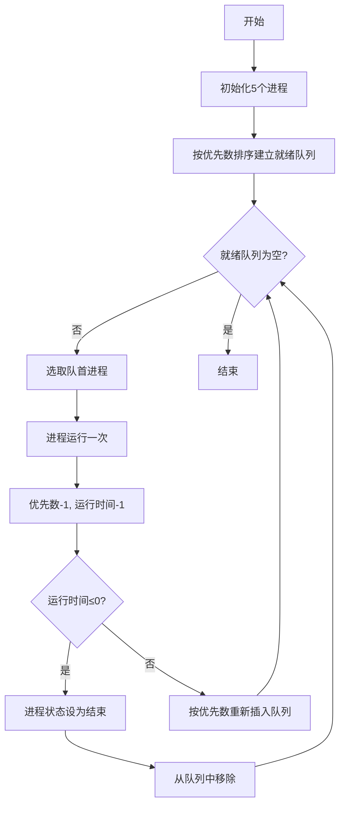

# 实验1 处理器调度

## 一、实验内容
按优先数调度算法实现处理器调度。

## 二、实验目的
在采用多道程序设计的系统中，往往有若干个进程同时处于就绪状态。当就绪进程个数大于处理器数时，就必须依照某种策略来决定哪些进程优先占用处理器。本实验模拟在单处理器情况下的处理器调度，帮助学生加深了解处理器调度的工作。

## 三、实验原理
设计一个按优先数调度算法实现处理器调度的程序。

### 1. 进程控制块(PCB)结构
每个进程用一个进程控制块PCB来代表，格式为：
- 进程名：作为进程的标识，本实验中为P1-P5
- 指针：按优先数大小连接进程队列
- 要求运行时间：进程需要运行的单位时间数
- 优先数：赋予进程的优先数，调度时总是选取优先数大的进程先执行
- 状态：就绪(R)或结束(E)

### 2. 程序中使用的数据结构及符号说明
- `struct PCB`：进程控制块结构体，包含进程的所有信息
  - `name`：string类型，存储进程名称（如P1、P2等）
  - `time`：int类型，表示进程还需要运行的时间单位数
  - `priority`：int类型，表示进程的优先级数值
  - `status`：char类型，'R'表示就绪状态，'E'表示结束状态
  - `next`：PCB*类型，指向下一个进程控制块的指针

- `class ReadyQueue`：就绪队列管理类，使用链表结构管理进程队列
  - `head`：PCB*类型，指向队列头部的指针
  - `insert()`：按优先数大小插入进程的方法
  - `getHead()`：获取队首进程的方法
  - `remove()`：从队列中移除指定进程的方法
  - `display()`：显示当前队列状态的方法
  - `isEmpty()`：判断队列是否为空的方法

- `vector<PCB*> processes`：用于存储所有进程指针的动态数组，方便统一管理

- 其他符号说明：
  - `srand(time(0))`：设置随机数种子，确保每次运行程序时生成不同的随机数
  - `rand() % n + 1`：生成1到n之间的随机整数
  - `to_string(i)`：将整数转换为字符串，用于生成进程名

### 2. 调度算法
- 将进程按优先数从大到小连成队列
- 处理器调度总是选队首进程运行
- 采用动态改变优先数的办法，进程每运行一次优先数减1
- 进程运行一次后，若要求运行时间>0，则重新按优先数插入队列；若要求运行时间=0，则状态改为"结束"并退出队列
- 重复上述步骤直到所有进程都成为"结束"状态

## 四、算法流程图


## 五、源程序及注释
```cpp
// 使用C++11标准编译
#include <iostream>
#include <cstdlib>
#include <ctime>
#include <vector>
#include <string>
#include <algorithm>
using namespace std;

// 进程控制块(PCB)结构体
struct PCB {
    string name;      // 进程名
    int time;         // 要求运行时间
    int priority;     // 优先数
    char status;      // 状态(R:就绪, E:结束)
    PCB* next;        // 指向下一个进程的指针
    
    PCB(string n, int t, int p) : name(n), time(t), priority(p), status('R'), next(nullptr) {}
};

// 就绪队列管理类
class ReadyQueue {
private:
    PCB* head;

public:
    ReadyQueue() : head(nullptr) {}
    
    // 按优先数排序插入进程
    void insert(PCB* process) {
        if (!head || process->priority > head->priority) {
            process->next = head;
            head = process;
        } else {
            PCB* current = head;
            while (current->next && current->next->priority >= process->priority) {
                current = current->next;
            }
            process->next = current->next;
            current->next = process;
        }
    }
    
    // 获取队首进程
    PCB* getHead() const {
        return head;
    }
    
    // 移除指定进程
    void remove(PCB* process) {
        if (!head) return;
        
        if (head == process) {
            head = head->next;
            return;
        }
        
        PCB* current = head;
        while (current->next && current->next != process) {
            current = current->next;
        }
        if (current->next) {
            current->next = current->next->next;
        }
    }
    
    // 显示当前队列状态
    void display() const {
        cout << "\n当前就绪队列:" << endl;
        cout << "进程名\t运行时间\t优先数\t状态" << endl;
        PCB* current = head;
        while (current) {
            cout << current->name << "\t" << current->time << "\t\t" 
                 << current->priority << "\t" << current->status << endl;
            current = current->next;
        }
    }
    
    // 检查队列是否为空
    bool isEmpty() const {
        return head == nullptr;
    }
};

// 处理器调度核心算法
void schedule(ReadyQueue& queue) {
    cout << "===== 开始处理器调度模拟 =====" << endl;
    int cycle = 1;
    
    while (!queue.isEmpty()) {
        PCB* current = queue.getHead();
        
        cout << "\n【调度周期 " << cycle++ << "】" << endl;
        cout << "选中进程: " << current->name << endl;
        
        // 模拟进程运行
        current->priority--;
        current->time--;
        
        // 更新状态
        if (current->time <= 0) {
            current->status = 'E';
            queue.remove(current);
            cout << "进程 " << current->name << " 运行结束" << endl;
        } else {
            queue.remove(current);
            queue.insert(current);
        }
        
        queue.display();
    }
    
    cout << "\n===== 所有进程已执行完毕 =====" << endl;
}

int main() {
    // 设置随机种子
    srand(time(0));
    
    ReadyQueue queue;
    vector<PCB*> processes;
    
    // 创建5个进程(P1-P5)
    for (int i = 1; i <= 5; i++) {
        string name = "P" + to_string(i);
        // 随机生成运行时间(1-5)和优先数(1-10)
        int time = rand() % 5 + 1;
        int priority = rand() % 10 + 1;
        
        PCB* p = new PCB(name, time, priority);
        processes.push_back(p);
        queue.insert(p);
    }
    
    // 显示初始状态
    cout << "===== 初始进程状态 =====" << endl;
    cout << "进程名\t运行时间\t优先数\t状态" << endl;
    for (PCB* p : processes) {
        cout << p->name << "\t" << p->time << "\t\t" 
             << p->priority << "\t" << p->status << endl;
    }
    
    // 执行调度
    schedule(queue);
    
    // 释放内存
    for (PCB* p : processes) {
        delete p;
    }
    
    return 0;
}
```

## 六、程序运行时初值和运行结果

### 1. 进程控制块的初始状态
```
===== 初始进程状态 =====
进程名  运行时间        优先数  状态
P1      1               3       R
P2      2               5       R
P3      2               9       R
P4      2               6       R
P5      1               7       R
```

### 2. 调度过程记录
```
【调度周期 1】
选中进程: P3
当前就绪队列:
进程名  运行时间        优先数  状态
P3      1               8       R
P5      1               7       R
P4      2               6       R
P2      2               5       R
P1      1               3       R
【调度周期 2】
选中进程: P3
进程 P3 运行结束
当前就绪队列:
进程名  运行时间        优先数  状态
P5      1               7       R
P4      2               6       R
P2      2               5       R
P1      1               3       R
【调度周期 3】
选中进程: P5
进程 P5 运行结束
当前就绪队列:
进程名  运行时间        优先数  状态
P4      2               6       R
P2      2               5       R
P1      1               3       R
【调度周期 4】
选中进程: P4
当前就绪队列:
进程名  运行时间        优先数  状态
P2      2               5       R
P4      1               5       R
P1      1               3       R
【调度周期 5】
选中进程: P2
当前就绪队列:
进程名  运行时间        优先数  状态
P4      1               5       R
P2      1               4       R
P1      1               3       R
【调度周期 6】
选中进程: P4
进程 P4 运行结束
当前就绪队列:
进程名  运行时间        优先数  状态
P2      1               4       R
P1      1               3       R
【调度周期 7】
选中进程: P2
进程 P2 运行结束
当前就绪队列:
进程名  运行时间        优先数  状态
P1      1               3       R
【调度周期 8】
选中进程: P1
进程P1 运行结束
当前就绪队列:
进程名  运行时间        优先数  状态
```

## 七、实验小结
本次实验实现了基于优先数调度算法的处理器调度模拟程序。通过创建进程控制块(PCB)数据结构，使用链表管理就绪队列，并按照优先数大小进行调度。

实验结果表明，调度算法能够正确地选择优先数最大的进程运行，并在每次运行后动态调整优先数。当进程运行时间减至0时，进程状态正确地变为"结束"并从队列中移除。

程序成功模拟了处理器调度的整个过程，包括：
1. 初始化5个进程并设置随机的优先数和运行时间
2. 按优先数排序建立就绪队列
3. 循环调度直到所有进程结束
4. 实时显示调度过程和队列变化

该模拟程序帮助理解了实际操作系统中处理器调度的工作机制，特别是优先数调度算法的实现原理和动态优先数调整策略。