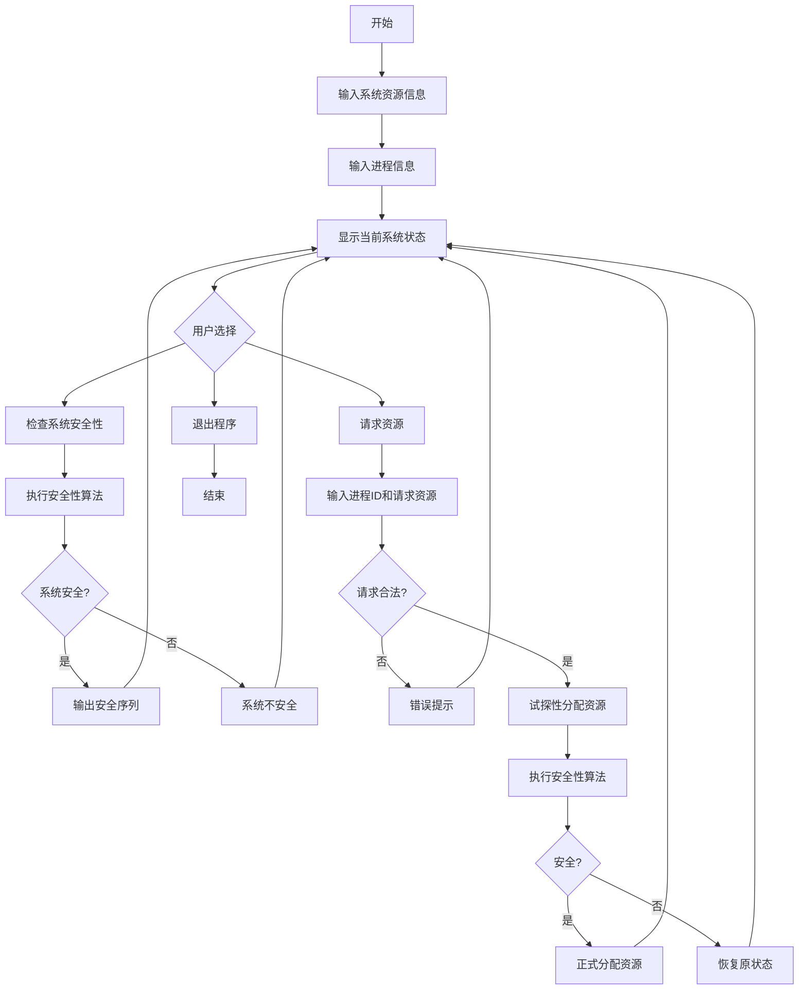

# 实验2 银行家算法的实现

## 一、实验内容
银行家算法的实现。

## 二、实验目的
银行家算法是一种最有代表性的避免死锁的算法。在避免死锁方法中允许进程动态地申请资源，但系统在进行资源分配之前，应先计算此次分配资源的安全性，若分配不会导致系统进入不安全状态，则分配，否则等待。通过编写一个模拟动态资源分配的银行家算法程序，帮助学生进一步深入理解死锁、产生死锁的必要条件、安全状态等重要概念，并掌握避免死锁的具体实施方法。

## 三、实验原理

### 3.1 银行家算法中的数据结构

#### 1）可利用资源向量Available
是一个含有m个元素的数组，其中的每一个元素代表一类可利用的资源数目。如果Available[j]=K，则表示系统中现有Rj类资源K个。

#### 2）最大需求矩阵Max
这是一个n×m的矩阵，它定义了系统中n个进程中的每一个进程对m类资源的最大需求。如果Max[i,j]=K，则表示进程i需要Rj类资源的最大数目为K。

#### 3）分配矩阵Allocation
这也是一个n×m的矩阵，它定义了系统中每一类资源当前已分配给每一进程的资源数。如果Allocation[i,j]=K，则表示进程i当前已分得Rj类资源的数目为K。

#### 4）需求矩阵Need
这也是一个n×m的矩阵，用以表示每一个进程尚需的各类资源数。如果Need[i,j]=K，则表示进程i还需要Rj类资源K个，方能完成其任务。  
Need[i,j]=Max[i,j]-Allocation[i,j]

### 3.2 银行家算法
设Requesti是进程Pi的请求向量，如果Requesti[j]=K，表示进程Pi需要K个Rj类型的资源。当Pi发出资源请求后，系统按下述步骤进行检查：
1. 如果Requesti[j]≤Need[i,j]，便转向步骤(2)；否则认为出错，因为它所需要的资源数已超过它所宣布最大值。
2. 如果Requesti[j]≤Available[j]，便转向步骤(3)；否则，表示尚无足够资源，Pi须等待。
3. 系统试探着把资源分配给进程Pi，并修改下面数据结构中的数值：
   - Available[j]=Available[j]-Requesti[j]
   - Allocation[i,j]=Allocation[i,j]+Requesti[j]
   - Need[i,j]=Need[i,j]-Requesti[j]
4. 系统执行安全性算法，检查此次资源分配后，系统是否处于安全状态。若安全，才正式将资源分配给进程Pi，以完成本次分配；否则，将本次的试探分配作废，恢复原来的资源分配状态，让进程Pi等待。

### 3.3 安全性算法
1. 设置两个向量：
   - 工作向量Work: 它表示系统可提供给进程继续运行所需的各类资源数目，它含有m个元素，在执行安全算法开始时，Work=Available
   - 工作向量Finish: 它表示系统是否有足够的资源分配给进程，使之运行完成。开始时先做Finish[i]=false; 当有足够资源分配给进程时，再令Finish[i]=true
2. 从进程集合中找到一个能满足下述条件的进程：
   - Finish[i]=false
   - Need[i,j]≤Work[j]
   若找到，执行步骤(3)，否则执行步骤(4)
3. 当进程Pi获得资源后，可顺利执行，直至完成，并释放出分配给它的资源，故应执行：
   - Work[j]=Work[j]+Allocation[i,j]
   - Finish[i]=true
   - 返回步骤(2)
4. 如果所有进程的Finish[i]=true都满足，则表示系统处于安全状态；否则，系统处于不安全状态

## 四、算法流程图


## 五、源程序及注释

### 5.1 程序中使用的数据结构及符号说明
- `vector<int> available`：可利用资源向量，表示每种资源的可用数量
- `vector<vector<int>> max`：最大需求矩阵，表示每个进程对每种资源的最大需求
- `vector<vector<int>> allocation`：分配矩阵，表示每个进程已分配的资源数量
- `vector<vector<int>> need`：需求矩阵，表示每个进程尚需的资源数量，计算公式为Need[i][j]=Max[i][j]-Allocation[i][j]
- `vector<int> work`：工作向量，在安全性算法中使用，初始值等于available
- `vector<bool> finish`：完成状态向量，标记进程是否已完成
- `int numProcesses`：进程数量
- `int numResources`：资源种类数量

```cpp
#include <iostream>
#include <vector>
#include <string>
using namespace std;

class BankerAlgorithm {
private:
    int numProcesses;    // 进程数量
    int numResources;    // 资源种类数量
    vector<int> available;     // 可利用资源向量
    vector<vector<int>> max;  // 最大需求矩阵
    vector<vector<int>> allocation;  // 分配矩阵
    vector<vector<int>> need;  // 需求矩阵

public:
    // 输入系统资源信息
    void inputResources() {
        cout << "请输入资源种类数量: ";
        cin >> numResources;
        
        available.resize(numResources);
        cout << "请输入每种资源的可用数量: ";
        for (int i = 0; i < numResources; i++) {
            cin >> available[i];
        }
    }

    // 输入进程信息
    void inputProcesses() {
        cout << "请输入进程数量: ";
        cin >> numProcesses;
        
        // 初始化矩阵
        max.resize(numProcesses, vector<int>(numResources));
        allocation.resize(numProcesses, vector<int>(numResources));
        need.resize(numProcesses, vector<int>(numResources));
        
        // 输入每个进程的最大需求
        cout << "\n请输入每个进程对每种资源的最大需求:" << endl;
        for (int i = 0; i < numProcesses; i++) {
            cout << "进程 P" << i << ": ";
            for (int j = 0; j < numResources; j++) {
                cin >> max[i][j];
            }
        }
        
        // 输入每个进程已分配的资源
        cout << "\n请输入每个进程已分配的资源数量:" << endl;
        for (int i = 0; i < numProcesses; i++) {
            cout << "进程 P" << i << ": ";
            for (int j = 0; j < numResources; j++) {
                cin >> allocation[i][j];
            }
        }
        
        // 计算需求矩阵
        calculateNeed();
    }

    // 计算需求矩阵
    void calculateNeed() {
        for (int i = 0; i < numProcesses; i++) {
            for (int j = 0; j < numResources; j++) {
                need[i][j] = max[i][j] - allocation[i][j];
            }
        }
    }

    // 显示当前状态
    void displayState() {
        cout << "\n当前系统状态:" << endl;
        cout << "可用资源: ";
        for (int i = 0; i < numResources; i++) {
            cout << available[i] << " ";
        }
        cout << endl;

        cout << "\n最大需求矩阵:" << endl;
        for (int i = 0; i < numProcesses; i++) {
            cout << "P" << i << ": ";
            for (int j = 0; j < numResources; j++) {
                cout << max[i][j] << " ";
            }
            cout << endl;
        }

        cout << "\n分配矩阵:" << endl;
        for (int i = 0; i < numProcesses; i++) {
            cout << "P" << i << ": ";
            for (int j = 0; j < numResources; j++) {
                cout << allocation[i][j] << " ";
            }
            cout << endl;
        }

        cout << "\n需求矩阵:" << endl;
        for (int i = 0; i < numProcesses; i++) {
            cout << "P" << i << ": ";
            for (int j = 0; j < numResources; j++) {
                cout << need[i][j] << " ";
            }
            cout << endl;
        }
    }

    // 安全性算法
    bool isSafe() {
        vector<int> work = available;
        vector<bool> finish(numProcesses, false);
        vector<int> safeSequence;

        cout << "\n执行安全性算法:" << endl;

        while (true) {
            bool found = false;
            for (int i = 0; i < numProcesses; i++) {
                if (!finish[i]) {
                    bool canExecute = true;
                    for (int j = 0; j < numResources; j++) {
                        if (need[i][j] > work[j]) {
                            canExecute = false;
                            break;
                        }
                    }

                    if (canExecute) {
                        cout << "进程 P" << i << " 可以执行" << endl;
                        for (int j = 0; j < numResources; j++) {
                            work[j] += allocation[i][j];
                        }
                        finish[i] = true;
                        safeSequence.push_back(i);
                        found = true;
                        break;
                    }
                }
            }

            if (!found) {
                break;
            }
        }

        bool isSafe = true;
        cout << "安全序列: ";
        for (int i = 0; i < numProcesses; i++) {
            if (!finish[i]) {
                isSafe = false;
                break;
            }
            cout << "P" << safeSequence[i];
            if (i < numProcesses - 1) cout << " -> ";
        }
        cout << endl;

        if (isSafe) {
            cout << "系统处于安全状态" << endl;
        } else {
            cout << "系统处于不安全状态" << endl;
        }

        return isSafe;
    }

    // 银行家算法核心
    void requestResources(int processId) {
        vector<int> request(numResources);
        cout << "请输入进程 P" << processId << " 的资源请求:" << endl;
        for (int i = 0; i < numResources; i++) {
            cout << "请求资源 R" << i << " 的数量: ";
            cin >> request[i];
        }

        // 检查请求是否合法
        for (int i = 0; i < numResources; i++) {
            if (request[i] > need[processId][i]) {
                cout << "错误: 请求的资源数量超过最大需求" << endl;
                return;
            }
            if (request[i] > available[i]) {
                cout << "错误: 系统没有足够的可用资源" << endl;
                return;
            }
        }

        // 试探性分配
        cout << "\n试探性分配..." << endl;
        vector<int> tempAvailable = available;
        vector<vector<int>> tempAllocation = allocation;
        vector<vector<int>> tempNeed = need;

        for (int i = 0; i < numResources; i++) {
            tempAvailable[i] -= request[i];
            tempAllocation[processId][i] += request[i];
            tempNeed[processId][i] -= request[i];
        }

        // 保存原始状态
        vector<int> originalAvailable = available;
        vector<vector<int>> originalAllocation = allocation;
        vector<vector<int>> originalNeed = need;

        // 更新为试探状态
        available = tempAvailable;
        allocation = tempAllocation;
        need = tempNeed;

        // 检查安全性
        if (isSafe()) {
            cout << "\n资源分配成功!" << endl;
        } else {
            cout << "\n资源分配会导致不安全状态，分配失败!" << endl;
            // 恢复原始状态
            available = originalAvailable;
            allocation = originalAllocation;
            need = originalNeed;
        }
    }

    // 主运行函数
    void run() {
        cout << "=== 银行家算法模拟程序 ===" << endl;
        
        inputResources();
        inputProcesses();
        
        while (true) {
            displayState();
            
            cout << "\n选择操作:" << endl;
            cout << "1. 检查系统安全性" << endl;
            cout << "2. 请求资源" << endl;
            cout << "3. 退出程序" << endl;
            cout << "请输入选择: ";
            
            int choice;
            cin >> choice;
            
            switch (choice) {
                case 1:
                    isSafe();
                    break;
                case 2: {
                    int processId;
                    cout << "请输入请求资源的进程ID (0-" << numProcesses-1 << "): ";
                    cin >> processId;
                    if (processId >= 0 && processId < numProcesses) {
                        requestResources(processId);
                    } else {
                        cout << "无效的进程ID!" << endl;
                    }
                    break;
                }
                case 3:
                    cout << "程序结束" << endl;
                    return;
                default:
                    cout << "无效选择!" << endl;
            }
        }
    }
};

int main() {
    BankerAlgorithm banker;
    banker.run();
    return 0;
}
```
为了更好地演示银行家算法的工作原理，建议使用以下经典的输入示例：

- **资源种类数量**: 3
- **可用资源数量**: 10 5 7
- **进程数量**: 5

**各进程最大需求矩阵Max**:
- 进程 P0: 7 5 3
- 进程 P1: 3 2 2
- 进程 P2: 9 0 2
- 进程 P3: 2 2 2
- 进程 P4: 4 3 3

**各进程已分配资源Allocation**:
- 进程 P0: 0 1 0
- 进程 P1: 2 0 0
- 进程 P2: 3 0 2
- 进程 P3: 2 1 1
- 进程 P4: 0 0 2

这个示例来源于经典的银行家算法教学案例，能够清晰地展示安全序列的计算过程和资源分配的安全性检查。

## 六、程序运行时初值和运行结果

### 完整运行结果
使用上述输入示例的完整运行结果：

```
=== 银行家算法模拟程序 ===
请输入资源种类数量: 3
请输入每种资源的可用数量: 10 5 7
请输入进程数量: 5

请输入每个进程对每种资源的最大需求:
进程 P0: 7 5 3
进程 P1: 3 2 2
进程 P2: 9 0 2
进程 P3: 2 2 2
进程 P4: 4 3 3

请输入每个进程已分配的资源数量:
进程 P0: 0 1 0
进程 P1: 2 0 0
进程 P2: 3 0 2
进程 P3: 2 1 1
进程 P4: 0 0 2

当前系统状态:
可用资源: 10 5 7

最大需求矩阵:
P0: 7 5 3
P1: 3 2 2
P2: 9 0 2
P3: 2 2 2
P4: 4 3 3

分配矩阵:
P0: 0 1 0
P1: 2 0 0
P2: 3 0 2
P3: 2 1 1
P4: 0 0 2

需求矩阵:
P0: 7 4 3
P1: 1 2 2
P2: 6 0 0
P3: 0 1 1
P4: 4 3 1

选择操作:
1. 检查系统安全性
2. 请求资源
3. 退出程序
请输入选择: 1

执行安全性算法:
进程 P1 可以执行
进程 P3 可以执行
进程 P4 可以执行
进程 P0 可以执行
进程 P2 可以执行
安全序列: P1 -> P3 -> P4 -> P0 -> P2
系统处于安全状态
```

当进程P1请求(2,1,3)资源时，系统正确检测到请求超过其最大需求而拒绝分配：
```
请输入请求资源的进程ID (0-4): 1
请输入进程 P1 的资源请求:
请求资源 R0 的数量: 2
请求资源 R1 的数量: 1
请求资源 R2 的数量: 3
错误: 请求的资源数量超过最大需求
```

## 七、实验小结
本次实验成功实现了银行家算法，通过创建C++程序模拟了操作系统中的资源分配过程。程序实现了以下核心功能：

1. **动态数据输入**：程序在运行时接收用户输入的资源种类、数量、进程信息等，符合实验要求。

2. **完整的数据结构**：实现了Available、Max、Allocation和Need四个关键数据结构，正确反映了银行家算法的数学模型。

3. **安全性算法**：实现了完整的安全性检查算法，能够找出安全序列或判断系统是否处于不安全状态。

4. **银行家算法核心**：实现了资源请求的完整处理流程，包括合法性检查、试探性分配和安全性验证。

5. **用户交互界面**：提供了清晰的菜单系统，用户可以方便地检查系统状态、请求资源或退出程序。

6. **错误处理**：程序对无效的进程ID、超出需求的资源请求等情况进行了适当的错误处理。

实验结果表明，银行家算法能够有效避免死锁的发生。当系统处于安全状态时，算法允许资源分配；当资源分配可能导致不安全状态时，算法会拒绝分配，从而保证系统的安全性。

通过本次实验，深入理解了死锁产生的四个必要条件（互斥、占有并等待、非抢占、循环等待）以及如何通过银行家算法来避免死锁。银行家算法的核心思想是：在分配资源前先进行"安全性检查"，只有在保证系统安全的前提下才进行资源分配，这是一种典型的"避免死锁"策略。