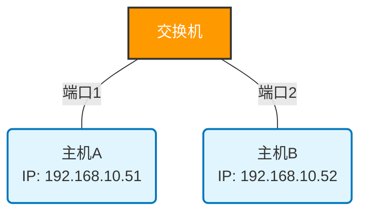

# 实验一 实验报告 — 双绞线的制作

## 一、实验准备
- 器材：压线钳、测线仪、非屏蔽双绞线、RJ-45 水晶头、两台主机、交换机。
- 实验环境：实验室台式机，Windows 操作系统。

## 二、网络拓扑设计

- 拓扑 A（主机 ↔ 交换机）：主机 A（192.168.10.51）—直通线—交换机—直通线—主机 B（192.168.10.52）。

## 三、实验步骤与结果
1. 双绞线制作
   - 按照 568B（或 568A）线序剥线、理线、剪齐并将导线塞入水晶头，使用压线钳压制。
   - 测试：用测线仪连接两端，直通线测试结果为 `1-1 2-2 3-3 4-4 5-5 6-6 7-7 8-8`。

2. 连接到交换机并测试
   - 将主机 A 与交换机连接，主机 B 与交换机连接，设置两台主机 IP：
     - 主机 A：`192.168.1.51/24`
     - 主机 B：`192.168.1.52/24`
   - 在主机 A 上运行 `ping 192.168.1.52 -t`，结果为应答。

## 四、实验思考与分析
- 将主机与交换机相连时，无论使用直通线还是交叉线（现代交换机很多支持自动 MDI/MDIX），通常都能连通；但传统设备下应使用直通线。原因：交换机的上行/下行端口与主机端口属于异种设备，线序相同（直通线）即可对应正确的收发引脚。
- 两台主机直接相连时需要交叉线（或两端都使用自动 MDI/MDIX 的网卡则自动调整），因为要将一端的发送引脚与另一端的接收引脚交叉连接。

## 五、实验总结
- 掌握了双绞线剥线、理线、压制并测试的基本流程；认识并正确区分 568A/568B、直通线与交叉线。
- 熟悉了 Windows 下设置 IP 地址并使用 `ping` 命令进行连通性测试。
