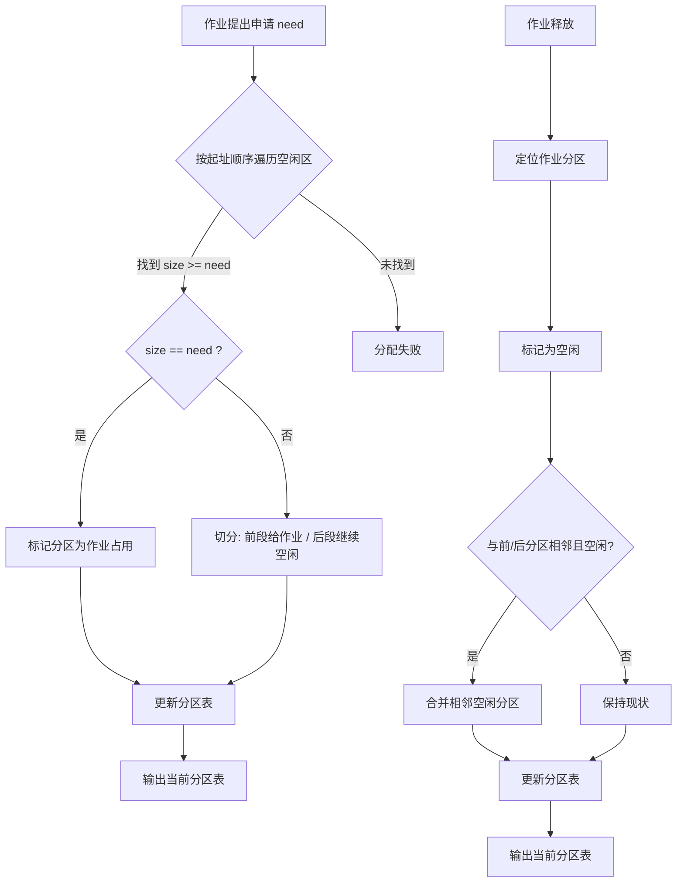

# 实验三报告：主存储器空间的分配和回收

## 一、实验目的
- 掌握可变分区方式下主存空间的分配与回收。
- 理解最先适应（First Fit）算法的切分与合并策略，能读写空闲区说明表。

## 二、实验环境
- 语言：C++17
- 平台：Windows 11

## 三、数据结构设计（C++）

| 类别   | 名称/方法/属性                       | 类型 / 返回值类型 | 核心功能与说明                                                                                                   |
| ------ | ------------------------------------ | ----------------- | ---------------------------------------------------------------------------------------------------------------- |
| 结构体 | `struct Block`                       | 结构体            | 表示主存中的一个分区（区块），包含起址、长度、空闲标志与占用作业名等信息。                                       |
| 字段   | `start`                              | `int`（K）        | 分区起始地址（以 K 为单位）。                                                                                    |
| 字段   | `size`                               | `int`（K）        | 分区长度（以 K 为单位）。                                                                                        |
| 字段   | `free`                               | `bool`            | 是否空闲：`true` 表示空闲；`false` 表示已分配。                                                                  |
| 字段   | `job`                                | `string`          | 占用该分区的作业标识（如 "1" 表示作业1）；空闲时为空串。                                                         |
| 变量   | `vector<Block> table`                | 容器              | 按起址有序维护的分区表，包含空闲分区和已分配分区，作为主存布局的核心数据结构。                                   |
| 函数   | `mergeFree(table)`                   | `void`            | 合并邻接的空闲分区：遍历分区表，若相邻块均为空闲则合并成更大块，减少外部碎片并保持表紧凑。                       |
| 函数   | `allocateFirstFit(table, job, need)` | `bool`            | 最先适应分配：顺序查找第一个 `size >= need` 的空闲区；等长则标记占用，过大则切分并插入分区表；返回是否分配成功。 |
| 函数   | `releaseJob(table, job)`             | `bool`            | 作业释放：根据作业标识找到对应分区并标记为空闲，随后调用 `mergeFree` 合并相邻空闲区，返回是否成功释放。          |
| 函数   | `canAllocate(table, need)`           | `bool`            | 可分配性检查：检查是否存在任一空闲分区 `size >= need`，仅用于判断能否满足申请。                                  |


- **初始状态**：总内存 640K，单一空闲分区 `[0, 640)`。
- **操作序列**：
  1. 作业1申请 300K
  2. 作业2申请 100K
  3. 作业1释放 300K
  4. 作业3申请 150K
  5. 作业4申请 30K
  6. 作业5申请 40K
  7. 作业6申请 60K
  8. 作业4释放 30K

## 四、运行结果（核心片段）
每步输出当前分区表（起址K/长度K/状态）：

```shell
初始空闲区说明表
序号  起址(K)   长度(K)   状态      
--------------------------------------------
0       0           640         未分配   

步骤1: 作业1 申请 300K -> 成功
当前主存分区
序号  起址(K)   长度(K)   状态
--------------------------------------------
0       0           300         作业1
1       300         340         未分配

步骤2: 作业2 申请 100K -> 成功
当前主存分区
序号  起址(K)   长度(K)   状态
--------------------------------------------
0       0           300         作业1
1       300         100         作业2
2       400         240         未分配

步骤3: 作业1 释放 -> 完成
当前主存分区
序号  起址(K)   长度(K)   状态
--------------------------------------------
0       0           300         未分配
1       300         100         作业2
2       400         240         未分配

步骤4: 作业3 申请 150K -> 成功
当前主存分区
序号  起址(K)   长度(K)   状态      
--------------------------------------------
0       0           150         作业3
1       150         150         未分配
2       300         100         作业2
3       400         240         未分配

步骤5: 作业4 申请 30K -> 成功
当前主存分区
序号  起址(K)   长度(K)   状态
--------------------------------------------
0       0           150         作业3
1       150         30          作业4
2       180         120         未分配
3       300         100         作业2
4       400         240         未分配

步骤6: 作业5 申请 40K -> 成功
当前主存分区
序号  起址(K)   长度(K)   状态
--------------------------------------------
0       0           150         作业3
1       150         30          作业4
2       180         40          作业5
3       220         80          未分配
4       300         100         作业2     
5       400         240         未分配

步骤7: 作业6 申请 60K -> 成功
当前主存分区
序号  起址(K)   长度(K)   状态
--------------------------------------------
0       0           150         作业3
1       150         30          作业4
2       180         40          作业5
3       220         60          作业6
4       280         20          未分配
5       300         100         作业2
6       400         240         未分配

步骤8: 作业4 释放 -> 完成
当前主存分区
序号  起址(K)   长度(K)   状态
--------------------------------------------
0       0           150         作业3
1       150         30          未分配
2       180         40          作业5
3       220         60          作业6
4       280         20          未分配
5       300         100         作业2
6       400         240         未分配

额外检查：若再申请 100K 作业空间，可以满足。
```

## 五、结论与小结
- 最先适应算法实现简单、搜索成本低，但释放后形成的碎片仍可能增多，需要及时合并相邻空闲区。
- 通过本次实验熟悉了分区表的维护、切分与合并逻辑，以及输出状态的设计。
- 如需进一步优化，可考虑最佳适应/最坏适应策略或空闲链表按大小排序以降低外碎片。