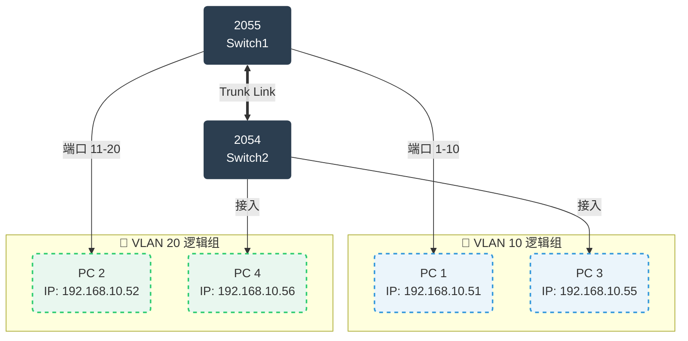
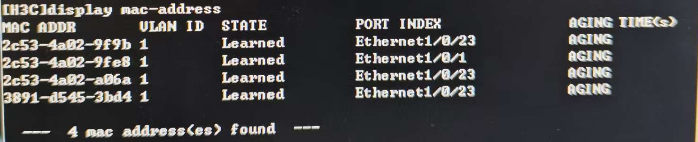
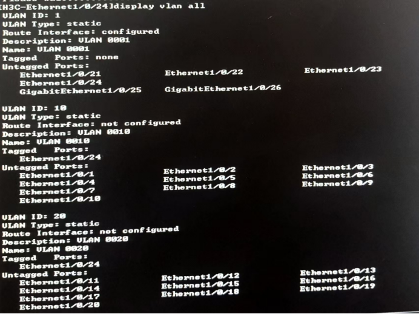
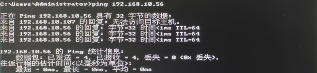

# 实验三 实验报告 — VLAN 配置

## 一、实验目的
- 掌握交换机 MAC 地址的学习过程。
- 掌握 VLAN 工作原理及 Access/Trunk 端口配置。

## 二、实验拓扑

## 三、实验任务与步骤

### 任务一：MAC 地址学习过程
1. 按照拓扑接线，将 PC1、PC2 连接至 Switch1，PC3、PC4 连接至 Switch2，且两台交换机相互连接，并配置对应主机的 IP 地址（如 192.168.10.51 等），确认交换机为初始状态。
2.  在 **PC1** 上执行 `ping 192.168.10.52` (即 ping PC2)，或者 `ping 192.168.10.55` (即 ping PC3)，记录交换机 `display mac-address` 输出。

### 任务二：Access 链路端口配置 (VLAN 划分)
1.  查看默认 VLAN (`display vlan all`) 与接口简要信息 (`display brief interface`)。
2.  在 **SW1** 和 **SW2** 上分别创建 `vlan 10` 与 `vlan 20`。
    - **SW1 配置**：将端口 **1-10** 分配给 VLAN 10，端口 **11-20** 分配给 VLAN 20。
    - **SW2 配置**：将连接 PC3 的端口分配给 VLAN 10，连接 PC4 的端口分配给 VLAN 20。
3.  验证 VLAN 划分：`display vlan all`。

4.  连通性测试 (同交换机不同 VLAN)：
    - 测试对象：**PC1** (VLAN 10) ping **PC2** (VLAN 20)。
    

**结论：**
- 不同 VLAN 属于不同的广播域，默认情况下无法进行二层通信，PC1 与 PC2 虽同在 SW1 但 VLAN 不同，故无法互通。

### 任务三：Trunk 链路端口配置 (跨交换机通信)
1.  配置交换机互联端口为 Trunk 模式：
    - `interface Ethernet 1/0/24`
    - `port link-type trunk`
    - `port trunk permit vlan all`
2.  查看端口与 VLAN 关联：`display interface Ethernet 1/0/24` 与 `display vlan all`。
3.  连通性测试 (跨交换机同 VLAN)**：
    - 测试对象：**PC2** (SW1, VLAN 20) ping **PC4** (SW2, VLAN 20)。
    - 预期结果：**通** (Reply from...)。
   

**结论：**
- 配置 Trunk 后，交换机之间的链路允许携带 VLAN 标签的数据帧通过。VLAN 20 的数据帧从 SW1 的 Trunk 端口发出时打上 Tag 20，SW2 的 Trunk 端口接收并识别该 Tag，确认属于允许通过的 VLAN，最后在转发给连接 PC4 的 Access 端口时剥离标签，还原为普通以太网帧发送给 PC。

## 四、实验思考与分析
- **MAC 学习机制**：交换机通过读取进入端口的数据帧的**源 MAC 地址**来完善 MAC 地址表；转发时依据**目的 MAC 地址**查找表项，若找不到则进行泛洪。
- **通信分析**：
    - PC1 能通 PC3：因为同属 VLAN 10 且 Trunk 链路允许 VLAN 10 通过。
    - PC1 不能通 PC2：因为 Access 端口隔离了不同 VLAN。
    - PC1 不能通 PC4：既跨了设备又跨了 VLAN，且没有三层路由设备。

## 五、实验总结
- 掌握了在 H3C设备上创建 VLAN、划分 Access 端口以及配置 Trunk 链路的标准命令。
- 理解了 VLAN 是通过 Tag 标记来隔离广播域，而 Trunk 链路则是为了承载多 VLAN 流量。