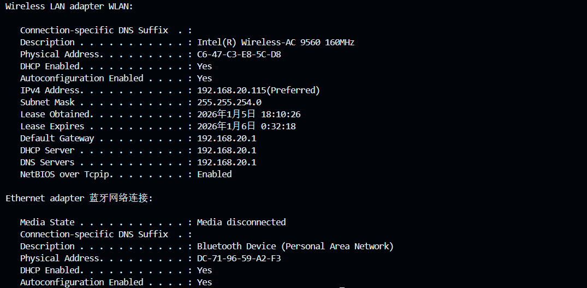
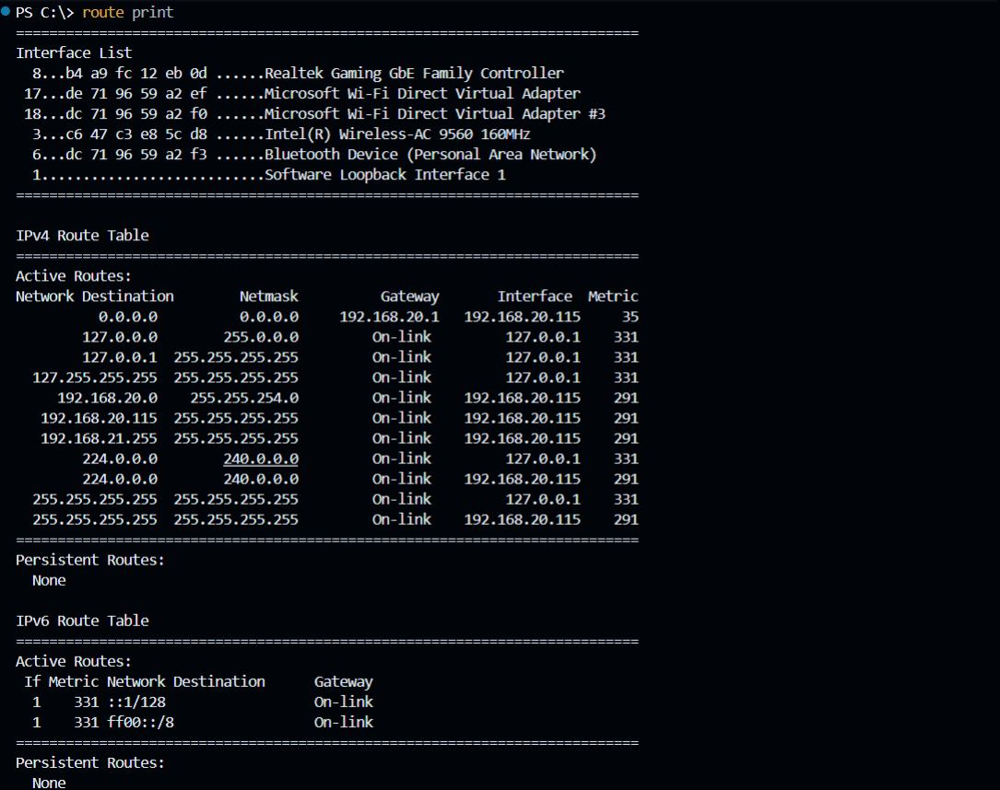

# 实验二 实验报告 — 常见网络测试命令使用

## 一、实验准备
- 器材：装有 Windows 系统的计算机。
- 网络环境：同一局域网内可互相 ping 的主机若干。

## 二、实验步骤与示例
1. 打开命令提示符（`cmd`），在命令后加 `/?` 阅读帮助信息，例如：`ping /?`。

2. 常用命令操作示例：
   - `ipconfig /all`：查看本机网络配置。
   
   - `ping 192.168.20.1 -t`：测试与网关或另一台主机的连通性。
   
   - `tracert 8.8.8.8`：跟踪到公网 DNS 的路由路径。
   
   - `nslookup www.example.com`：查询域名解析。
   
   - `arp -a`：查看 ARP 缓存。
   
   - `route print`：查看路由表。
   
   - `netstat -ano`：查看当前连接和监听端口（可用 `tasklist /fi "PID eq <pid>"` 定位进程）。
   
   - `ipconfig /release` 后 `ipconfig /renew`：在 DHCP 环境下释放并续租 IP。
   
   

3. 远程桌面测试
   - 使用“远程桌面连接”输入被控主机 IP 并登录。

## 三、实验思考题
1. ping 命令作用：测试目标主机是否可达、判断丢包和 RTT（往返时延），用于基本连通性检查与性能初步判断。
2. tracert 命令作用：显示数据包经过的每一跳路由节点和每跳延迟，帮助定位故障或瓶颈的网络段。
3. nslookup 进行域名解析：输入 `nslookup <域名>`，可查看默认/指定 DNS 返回的 IP 记录，验证 DNS 是否正常解析。
4. arp 指令能否防止 ARP 欺骗：不能。`arp` 仅用于查看和管理本机缓存，防止 ARP 欺骗需要启用静态 ARP 条目或使用网络安全设备与防护策略。
5. 查看当前主机网络连接信息：`ipconfig /all`、`netstat -ano`、`arp -a` 等命令可以联合使用查看适配器、连接和 ARP 缓存信息。

## 四、实验总结
- 掌握了常见网络诊断命令的基本用法及输出含义，能利用它们快速定位网络连通性与路由问题。
- 学会了启用并使用远程桌面进行远程操作与测试。